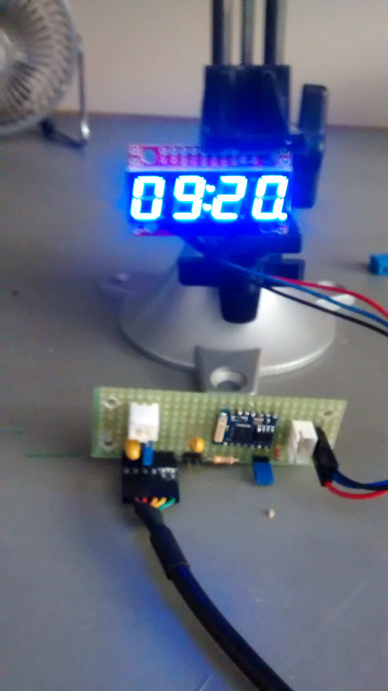

**ESP8266-NTP-CLOCK**

A no-set clock using an ESP8266 module and a Sparkfun clock display. No other boards are required as this code runs on the ESP8266 natively. 
This project uses the Simple Network Time Protocol (SNTP) to get the time from a list of user specified time servers, and uses MQTT to set configuration options.  

**Device Path**

The device path encompasses subtopics command and status. Commands are sent to $devicepath/command (which the nodes subscribes to.) All status messages are
published by the node on $devicepath/status except for power on message which is published on /node/info. the The device path is set using the patching procedure described later.

**Control Messages**

Control messages are received by all nodes on /node/control. These are meant to be used to interrogate the nodes connected to the network, 
and perform other system-wide control functions.

One control message is currently supported: *muster*. This directs the node to re-send the node configuration information to /node/info. See the power on message below for further details

**Command Messages**

|Command| Description |
|-------| ----------- |
|TIME24:n 	| Sets display format 1 = 24 hour, 0 = 12 hour|
|UTCOFFSET:n	| Sets offset in seconds from UTC|
|SURVEY	| Returns WIFI survey information as seen by the node|
|SSID:n| Query or set SSID|
|WIFIPASS:n| Query or set WIFI password|
|RESTART| Restarts the clock

Notes:

* Sending an SSID, or WIFIPASS command without a parameter will return the current value
* SSID:n, WIFIPASS:n change not effective until next system restart

Status messages which can be published:

* SSID:yourssid
* WIFIPASS:yourwifipass
* WIFI survey data in the following format: ap:$AP;chan:$CHAN;rssi:$RSSI. Can be multiple lines. One entry per line. 

**MQTT Power on Message**

After booting, the node publishes a message to /node/info with the following data:

|Field		| Description|
|-----      | -----------|
|CONNSTATE	| Indicates device is on line|
|DEVICE		| A device path (e.g. /home/lab/clock)|
|IP ADDRESS	| The IP address assigned to the node|
|SCHEMA		| A schema name of hwstar.ntpclock (vendor.product ala xPL)|
|SSID		| SSID in use

The schema may be used to design a database of supported commands for each device:

muster{connstate:online,device:/home/lab/clock,ip4:127.0.0.1,schema:hwstar.ntpclock,ssid:yourssid}

**Last Will and Testament**

The following will be published to /node/info if the node is not heard from by the MQTT broker:

connstate:offline;device:$DEVICE

**Configuration Patcher**

NB: WIFI and MQTT Configration is not stored in the source files. It is patched in using a custom Python utility which is available on my github account as
a separate project.The patcher allows the WWID, password, time zone, and other configuration options to be specified using a target in the Makefile.
The python script can be obtained here:
  
https://github.com/hwstar/ESP8266-MQTT-config-patcher

**Toolchain**

This code requires the ESP8266 toolchain be installed on a Linux box. 
Windows and Mac machines are not supported as I have no way to test on those platforms.
The toolchain can be obtained from here:

https://github.com/esp8266/esp8266-wiki/wiki/Toolchain

**Electrical Details**

Serial data is output on GPIO2 at 9600 baud 8 bits, 1 stop bit with no parity. The Sparkfun clock display is part number COM-11629.

LICENSE - "MIT License"

Copyright (c) 2015 Stephen Rodgers
 
MQTT code Copyright (c) 2014-2015 Tuan PM, https://twitter.com/TuanPMT

Permission is hereby granted, free of charge, to any person obtaining a copy of this software and associated documentation files (the "Software"), to deal in the Software without restriction, including without limitation the rights to use, copy, modify, merge, publish, distribute, sublicense, and/or sell copies of the Software, and to permit persons to whom the Software is furnished to do so, subject to the following conditions:

The above copyright notice and this permission notice shall be included in all copies or substantial portions of the Software.

THE SOFTWARE IS PROVIDED "AS IS", WITHOUT WARRANTY OF ANY KIND, EXPRESS OR IMPLIED, INCLUDING BUT NOT LIMITED TO THE WARRANTIES OF MERCHANTABILITY, FITNESS FOR A PARTICULAR PURPOSE AND NONINFRINGEMENT. IN NO EVENT SHALL THE AUTHORS OR COPYRIGHT HOLDERS BE LIABLE FOR ANY CLAIM, DAMAGES OR OTHER LIABILITY, WHETHER IN AN ACTION OF CONTRACT, TORT OR OTHERWISE, ARISING FROM, OUT OF OR IN CONNECTION WITH THE SOFTWARE OR THE USE OR OTHER DEALINGS IN THE SOFTWARE.
